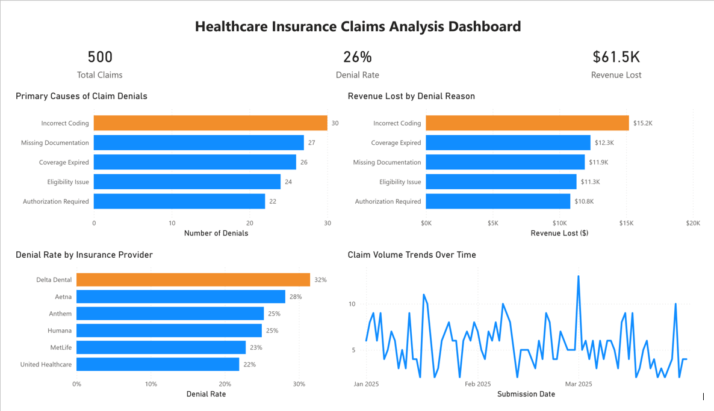

# Healthcare Insurance Claims Analysis Dashboard

## Overview

This project analyzes healthcare insurance claims data using SQL Server and Power BI to identify denial trends, quantify revenue loss, and evaluate payer performance.

## Dashboard Preview

## Tools Used

* SQL Server
* Power BI
* DAX
* Excel/CSV
* GitHub

## Dataset

* 500 simulated healthcare insurance claims
* Variables include:

  * Insurance Provider
  * Denial Status
  * Denial Reason
  * Claim Amount
  * Approved Amount
  * Submission Date
  * Service Type

## Key Findings

* Total Claims Analyzed: 500
* Claim Denial Rate: 26%
* Revenue Lost: $61.5K
* Top Denial Reason: Incorrect Coding
* Highest Denial Rate: Delta Dental (32%)

## Dashboard Components

* KPI Cards
* Primary Causes of Claim Denials
* Revenue Lost by Denial Reason
* Denial Rate by Insurance Provider
* Claim Volume Trends Over Time

## Business Recommendations

* Improve coding accuracy and documentation practices.
* Strengthen front-end insurance verification processes.
* Monitor payer-specific denial patterns.
* Implement regular denial management reporting.

